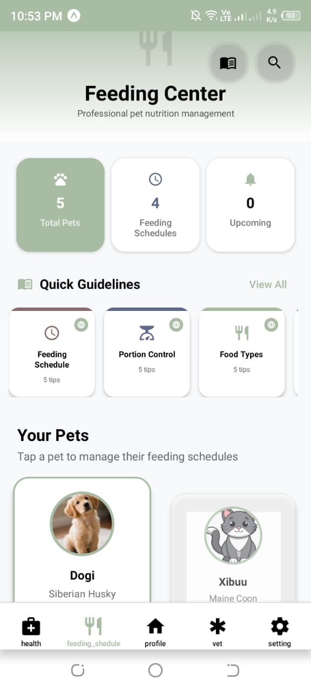

# 🐾 Pet Health Tracker App

A comprehensive mobile application built with **React Native + Expo** for tracking your pet's health records, including vaccinations, checkups, medications, and treatments. Keep your furry friends healthy with smart reminders and intuitive health monitoring.


---

## 📱 Screenshots

| Dashboard | Login | Health Records | Feeding Shedule |
|-----------|-------------|----------------|-----------|
|  |  |  |  |

---
## 📺 Demo Video

Watch the walkthrough/demo of **Pet Health Tracker App**:

[](https://youtu.be/hIrTED1YnL8)

---

## 📥 Download APK

Get the latest APK from Google Drive:

[](https://docs.google.com/uc?export=download&id=1nNxPv0brYW2vNC3-gP6cehbMypNrcMiK)

---
## 🚀 Key Features

### 📊 Health Record Management
- **Add, update, and delete** comprehensive health records for your pets
- Support for multiple record types: **vaccination, checkup, medication, treatment**
- **Search and filter** records by date, type, or veterinarian

### ⏰ Smart Reminders
- **Automated reminders** for upcoming vaccinations and checkups
- **Custom reminder intervals** (daily, weekly, monthly, yearly)

### 🎨 Modern User Interface
- **Gradient-based design** with intuitive navigation
- **Dark and light mode** support
- **Responsive layout** that works on all screen sizes
- **Accessibility features** for users with disabilities

### 🔄 Cross-Platform Compatibility
- **Android** (native and web)

### 🐕 Multi-Pet Management
- Manage health records for **multiple pets**
- **Pet profiles** with photos and basic information
- **Quick pet switching** from the dashboard
- **Individual reminder settings** per pet

---

## 📦 Tech Stack

| Category | Technology |
|----------|------------|
| **Framework** | [React Native](https://reactnative.dev/) |
| **Development Platform** | [Expo](https://expo.dev/) |
| **Language** | [TypeScript](https://www.typescriptlang.org/) |
| **Backend & Database** | [Firebase](https://firebase.google.com/) (Firestore & Auth) |
| **Navigation** | [React Navigation](https://reactnavigation.org/) |
| **Date/Time Picker** | [@react-native-datetimepicker](https://github.com/react-native-datetimepicker/datetimepicker) |
| **State Management** | React Context API |
| **Styling** | React Native StyleSheet + Expo LinearGradient |

---

## ⚙️ Installation & Setup

### Prerequisites
- **Node.js** (v16 or higher)
- **npm** or **yarn**
- **Expo CLI** (`npm install -g @expo/cli`)
- **Android Studio** (for Android development)
- **Xcode** (for iOS development - Mac only)

### 1. Clone the Repository

```bash
git clone https://github.com/your-username/pet-health-tracker.git
cd pet-health-tracker
```

### 2. Install Dependencies

```bash
# Using npm
npm install

# Using yarn
yarn install
```

---

## ▶️ Running the Application

### Development Mode

```bash
# Start the Expo development server
npx expo start
```

**Platform-specific commands:**
- Press `a` → Open on **Android Emulator**
- Press `i` → Open on **iOS Simulator**
- Press `w` → Open in **Web Browser**
- **Scan QR code** → Open on physical device using Expo Go app

### Production Build

```bash
# Build for Android (APK)
npx expo build:android

# Build for iOS (IPA)
npx expo build:ios

# Build for Web
npx expo build:web
```

### Using EAS Build (Recommended)

```bash
# Install EAS CLI
npm install -g @expo/eas-cli

# Configure EAS
eas build:configure

# Build for production
eas build --platform all
```

---

## 🛠 Development Commands

| Command | Description |
|---------|-------------|
| `npm start` | Start Expo development server |
| `npm run android` | Run on Android emulator |
| `npm run ios` | Run on iOS simulator |
| `npm run web` | Run on web browser |
| `npm run lint` | Run ESLint for code quality |
| `npm run lint:fix` | Fix ESLint issues automatically |
| `npm run test` | Run Jest unit tests |
| `npm run test:watch` | Run tests in watch mode |
| `npx expo doctor` | Check for common issues |
| `npx expo install --fix` | Fix dependency issues |

---


## 🧪 Testing

### Running Tests

```bash
# Run all tests
npm test

# Run tests in watch mode
npm run test:watch

# Run tests with coverage
npm run test:coverage
```


---

## 🚀 Deployment

### Expo Application Services (EAS)

```bash
# Install EAS CLI
npm install -g @expo/eas-cli

# Login to Expo account
eas login

# Configure project
eas build:configure

# Build for production
eas build --platform all

# Submit to app stores
eas submit --platform ios
eas submit --platform android
```

### Web Deployment (Netlify/Vercel)

```bash
# Build web version
npx expo export:web

# Deploy to Netlify
npm install -g netlify-cli
netlify deploy --prod --dir web-build

# Deploy to Vercel
npm install -g vercel
vercel --prod
```

---

## 🐛 Troubleshooting

### Common Expo Issues

**Metro bundler cache problems:**
```bash
npx expo start --clear
rm -rf node_modules
npm install
```

**Android build errors:**
```bash
npx expo install --fix
npx expo doctor
```

**iOS simulator issues:**
```bash
# Check available simulators
xcrun simctl list devices

# Reset simulator
xcrun simctl erase all
```

### Firebase Issues

**Authentication problems:**
- Verify Firebase configuration keys
- Check Authentication providers in Firebase Console
- Ensure app domains are authorized

**Firestore permission denied:**
```javascript
// Update security rules for development
rules_version = '2';
service cloud.firestore {
  match /databases/{database}/documents {
    match /{document=**} {
      allow read, write: if request.auth != null;
    }
  }
}
```

**Network connectivity issues:**
- Check internet connection
- Verify Firebase project is active
- Test with Firebase Emulator for local development

### Performance Issues

**Slow app startup:**
```bash
# Enable Hermes engine (Android)
# In app.json:
{
  "expo": {
    "jsEngine": "hermes"
  }
}
```

**Memory issues:**
- Optimize images (use WebP format)
- Implement lazy loading for large lists
- Use React.memo for expensive components

---


### Code Style

```bash
# Install development dependencies
npm install

# Run linting
npm run lint

# Fix auto-fixable issues
npm run lint:fix

# Format code
npm run format
```

### Pull Request Process

1. Update README.md with details of changes
2. Add tests for new functionality
3. Ensure all tests pass
4. Update version numbers following SemVer
5. Request review from maintainers

---

## 👨‍💻 Authors & Contributors

**Primary Maintainer**
- 👤 **Ishani Ekanayaka** - *Initial work & development*
  - 📧 Email: ishaniekanayaka27@gmail.com
  - 🌐 GitHub: [@Ishani Ekanayaka](https://github.com/ishaniekanayaka/)
 
---

## 🙏 Acknowledgments

- **React Native Community** for excellent documentation
- **Expo Team** for the amazing development platform
- **Firebase** for robust backend services


---


**Made with ❤️ for pet owners everywhere** 🐕🐱🐰
